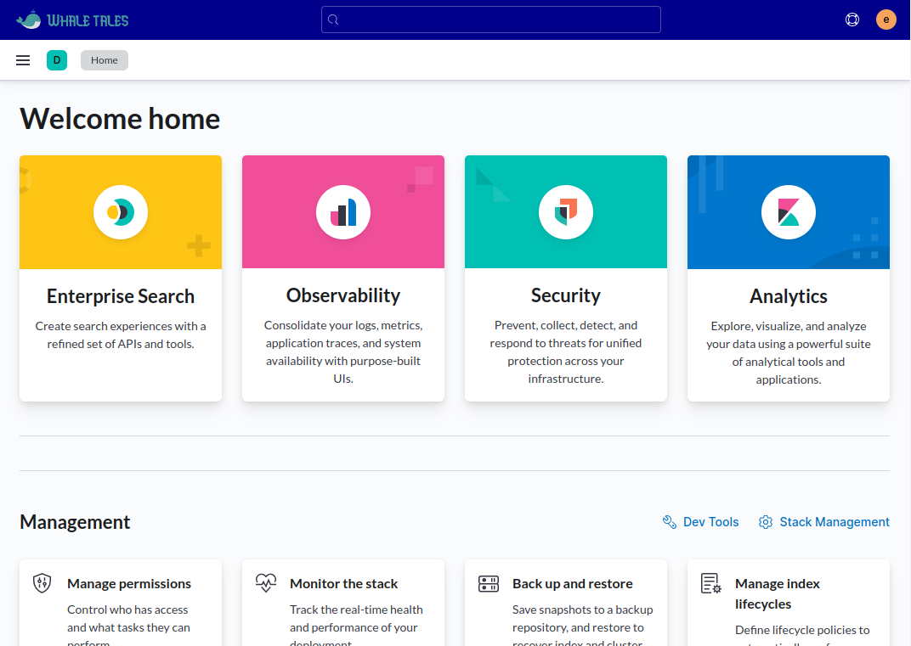

# Custom Kibana Logo

A Kibana plugin to customise the Kibana UI, including:
- Loader logo and text
- Login form
- Header logo
- Spaces selector logo
- Search bar text
- Dashboard colors
- Fonts and font sizes




## Known limitations

When Kibana first loads, it shows a Kibana loader for a few seconds. 
Since it is shown before any css is loaded, it is impossible to change that loader without modifying the source code of the plugin.

---

## Development

Checkout the appropriate version of kibana

```
git clone --single-branch --branch 7.17 https://github.com/elastic/kibana.git kibana-7.17
```

Setup the kibana for local development

```
cd kibana-7.17
yarn kbn bootstrap 
```

Clone the plugin into the plugins directory.
You may also fork the project to customize it and check out your own version of the plugin.

```
cd plugins
git clone https://github.com/lizozom/custom-kibana-logo.git
```

Go back to the kibana folder and start Elasticsearch in dev mode

```
cd ..
yarn es snapshot
```

Start Kibana in dev mode (This might take a while the first time)

```
cd ..
yarn start
```

Kibana should start with the plugin on.
It will watch any changes in the plugin and rebuild it as needed.

