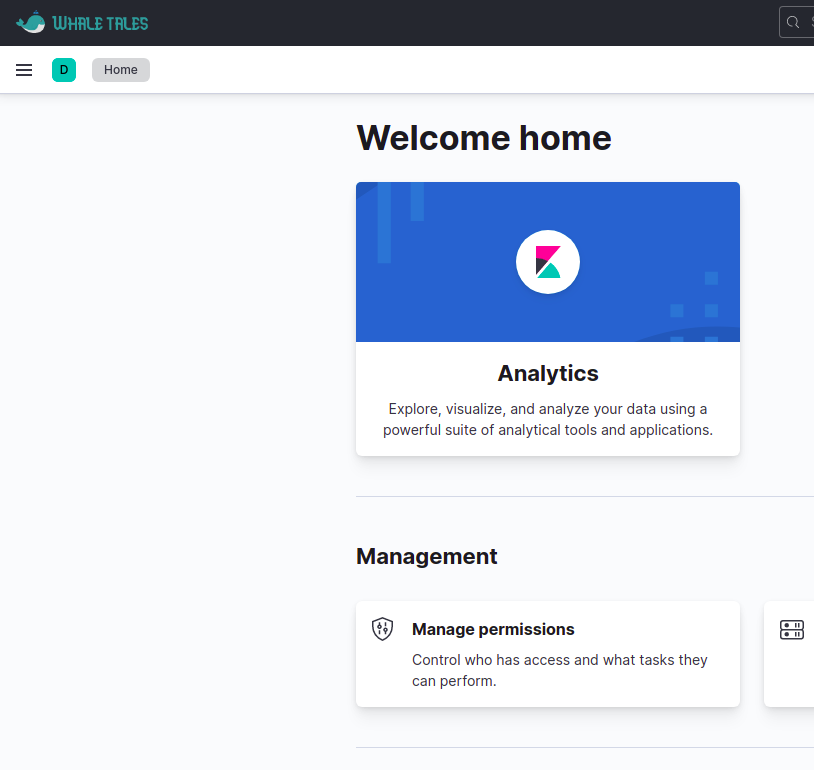

# Custom Kibana Logo

A Kibana plugin that allows you to customize:

- The Kibana main logo
- The login form text and logo
- The Kibana loading page and text (except for during initial load of an unauthenticated user)

---

## Development

1. [Set up the Kibana plugin development environment](docs/DEVELOPMENT_GUIDE.md)
2. Modify the URLs and texts in [index.scss](public/index.scss)
3. [Create, install and remove a Kibana plugin](docs/DEPLOYMENT_GUIDE.md)
